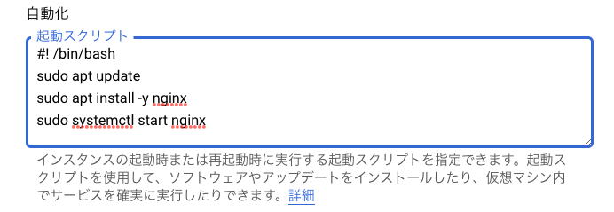
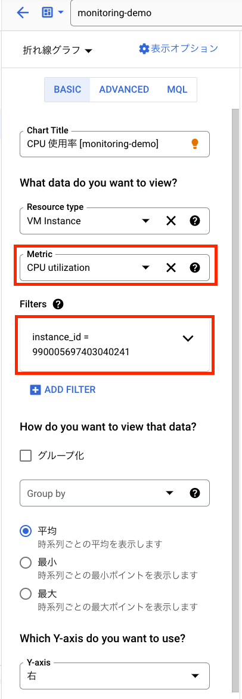
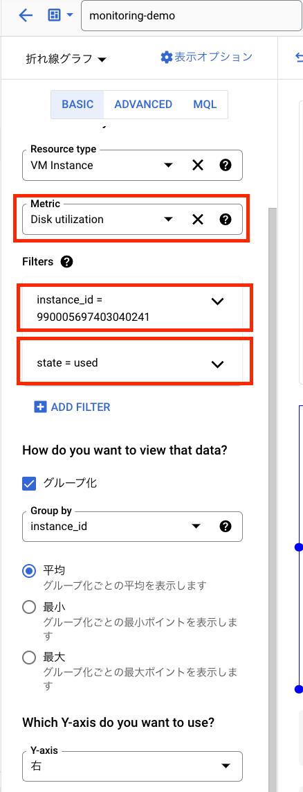
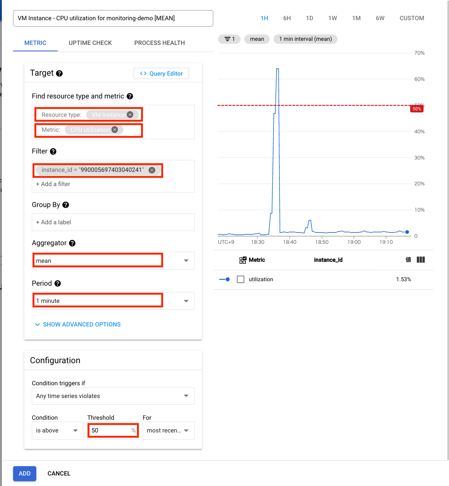
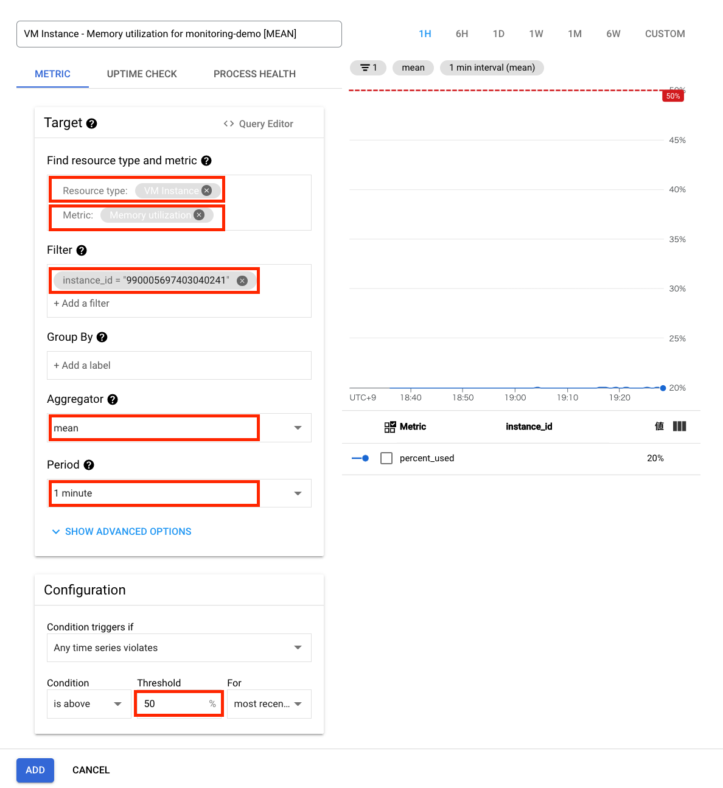
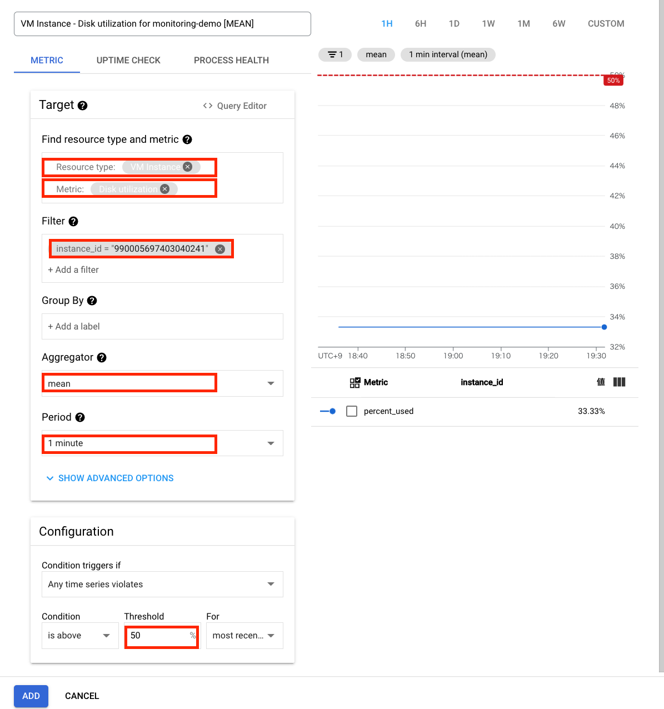

# Cloud Monitoring デモ

## 目的
1. Cloud Monitoring の使い方の概要を知る
2. **カスタムダッシュボード**でリソースの負荷状況をモニタリングする方法を知る
3. **アラート**で負荷状況を検知する方法を知る
4. 負荷状況に応じて**通知**を送る方法を知る

## 手順概要
1. デモ用のGCE を作成
2. Cloud Monitoring のダッシュボードでリソースの負荷状況を確認する
3. 負荷を検知した時の通知方法を設定する
4. 負荷を検知するアラートの設定をする
5. GCE に負荷をかける
6. ダッシュボードで負荷が上昇していることを確認する
7. 負荷を検知し、アラートが通知されることを確認する
   
## 手順
### 前提
本デモはGCP のコンソール画面上で行います。 

### 1. デモ用のGCE を作成
1. コンソール画面のハンバーガーメニューから、**Compute Engine** -> **VM インスタンス**をクリック
2. **インスタンスを作成**からGCE の作成画面に移動
3. **任意の名前**を入力、マシンタイプを**e2-micro**に変更

4.  **HTTPトラフィックを許可する**にチェック
 
5. **起動スクリプト**に以下コマンドを入力し**作成**をクリック

```
#!/bin/bash
sudo apt update
sudo apt install -y nginx 
sudo systemctl start nginx
```
6. インスタンスが作成されたことを確認


### 2. Cloud Monitoring のダッシュボードでリソースの負荷状況を確認する
#### 2.1 デモインスタンスにエージェントをインストールする
1. コンソール画面のハンバーガーメニューから、**Monitoring** -> **概要**をクリック
2. **VM を表示**をクリック

3. デモ用に作成したGCE インスタンスを選択し、**エージェントをインストール**をクリック

4. **CLOUD SHELL で実行**を選択  

5. エージェントがインストールされたことを確認

6. インスタンス名をクリック
7. リソースの負荷状況が表示されることを確認
#### 2.2 ダッシュボードを作成する
1. コンソール画面のサイドメニューから、**ダッシュボード**をクリック
2. 画面上部の**CREATE DASHBOARD**をクリック
3. 各モニタリング指標を追加ああ
4. メトリクスに**CPU utilization**、Filters にデモで作成したインスタンスのIDを選択し、監視項目を追加

5. メトリクスに**Memory utilization**、Filters にデモで作成したインスタンスのIDを選択し、監視項目を追加

6. メトリクスに**Disk utilization**、Filters にデモで作成したインスタンスのIDを選択し、監視項目を追加


### 3. 負荷を検知した時の通知方法を設定する
#### Email 通知 を設定する場合
1. 上部の検索タブから**通知チャンネル**に移動
2. **Add New**をクリック
3. 任意のアドレスと名前を入力し**SAVE**をクリック

### 4. 負荷を検知するアラートの設定をする
1. コンソール画面のサイドメニューから、**アラート**をクリック
2. **CREATE POLICY**をクリック
3. **ADD CONDITION**をクリック
4. 以下を入力し、CPU の使用率が分間で50%以上になった場合、アラートをあげる監視項目を追加  
    ①Resouce type：**VM Instanc**  
    ②Metric：**CPU utilization**  
    ③Filter：**instance_id = {デモインスタンスのID}**  
    ④Aggregator：**mean**  
    ⑤Period：**1 minute**  
    ⑥Threshold：**50**

5. 以下を入力し、Memory の使用率が分間で50%以上になった場合、アラートをあげる監視項目を追加  
    ①Resouce type：**VM Instanc**  
    ②Metric：**Memory utilization**  
    ③Filter：**instance_id = {デモインスタンスのID}**  
    ④Aggregator：**mean**  
    ⑤Period：**1 minute**  
    ⑥Threshold：**50**

6. 以下を入力し、Disk の使用率が分間で50%以上になった場合、アラートをあげる監視項目を追加  
    ①Resouce type：**VM Instanc**  
    ②Metric：**Disk utilization**  
    ③Filter：**instance_id = {デモインスタンスのID}**  
    ④Aggregator：**mean**  
    ⑤Period：**1 minute**  
    ⑥Threshold：**50**

7. **次へ**をクリック
8. Notification Channels で事前に作成した通知方法を選択
9. 任意の名前を入力し**SAVE**をクリック

### 5. GCE に負荷をかける
1. コンソール画面のハンバーガーメニューから、**Compute Engine** -> **VM インスタンス**をクリック
2. デモインスタンスにSSHログイン
3. デモインスタンスで以下コマンドを実行し、リソースに負荷を与える
```
# CPU 負荷
yes >> /dev/null &  
# メモリ負荷
/dev/null < $(yes) &
# disk 負荷
df
dd if=/dev/zero of=/dummy bs=1M count=1000
```

### 6. ダッシュボードで負荷が上昇していることを確認する
1. コンソール画面のハンバーガーメニューから、**Monitoring** -> **ダッシュボード**をクリック
2. 作成したカスタムダッシュボードをクリック
3. 負荷をかけたリソースの使用量を確認

### 7. 負荷を検知し、アラートが通知されることを確認する
1. コンソール画面のサイドメニューから、**アラート**をクリック
2. **incidents**の項目に作成したポリシーのアラートが検知されていることを確認
3. 作成した通知先にアラートのメッセージが送信されていることを確認